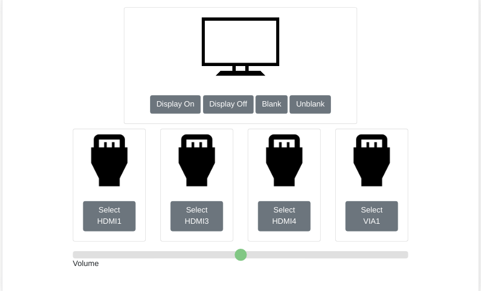

== Demo UI

With the Demo UI docker container running you can view it at `+localhost:8081+` using the chromium-browser running on the pi.

Here is a screenshot of the UI that has been created for the purposes of this demo.

This UI will give you basic control ofver the room, allowing you to turn on and off the display, change or mute the volume, and change inputs. This UI was created with basic HTML and JQuery and can be easily created with a different frameworks. At Brigham Young university we use an Angular application, but hopefully this UI can give you ideas of the kind of interface you can build that matches the design patterns your organization has.

Note: If there is an error in the UI check the console for any network errors and make sure that the URL in the index.js file is set to `+http://localhost:8000/buildings/DEMO/rooms/123/configuration+`. If the error persits check to see if the database is configured and running properly (as described in the databse setup section of this guide) and you may want to hit the endpoint using an application such as Postman to see what error is being returned.
